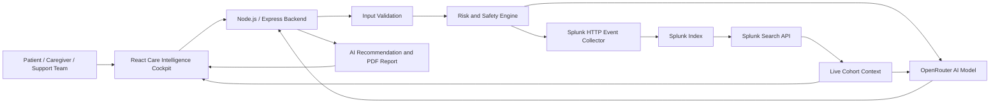

# OncoConnect AI Architecture

## System Overview

OncoConnect AI combines a React dashboard, a Node.js backend, Splunk observability services, an AI provider, and a deterministic safety layer.

## Data Flow

1. The user enters symptom and contextual information in the React dashboard.
2. The Node.js backend validates symptom values.
3. The risk engine calculates a structured symptom-risk score.
4. Deterministic safety rules check for red-flag symptoms.
5. Check-in data and AI results are sent to Splunk through HEC.
6. The backend retrieves live metrics through the Splunk Search API.
7. Recent Splunk metrics are converted into live cohort context.
8. The AI model receives patient context, risk data, evidence context, and Splunk cohort context.
9. If a red flag is detected, the rule-based safety layer overrides the generated AI recommendation.
10. The dashboard displays the result, telemetry, trend information, and report output.

## Main Components

### React Frontend

* Symptom and context input
* AI execution console
* Splunk live metrics
* Live cohort comparison
* Trend and reasoning visualizations
* PDF export

### Node.js Backend

* Input validation
* Risk calculation
* Red-flag detection
* AI orchestration
* Splunk HEC integration
* Splunk Search API integration

### Splunk

* Stores symptom check-ins
* Stores AI summary events
* Aggregates risk telemetry
* Supplies recent cohort context
* Supports operational observability

### AI Layer

* Generates structured support recommendations
* Uses patient and telemetry context
* Produces a non-diagnostic output
* Falls back to deterministic rules when unavailable

### Safety Layer

* Runs independently from the language model
* Detects fever, breathing difficulty, severe vomiting, and confusion
* Overrides generated recommendations when necessary
* Marks the result as a rule-based safety override

