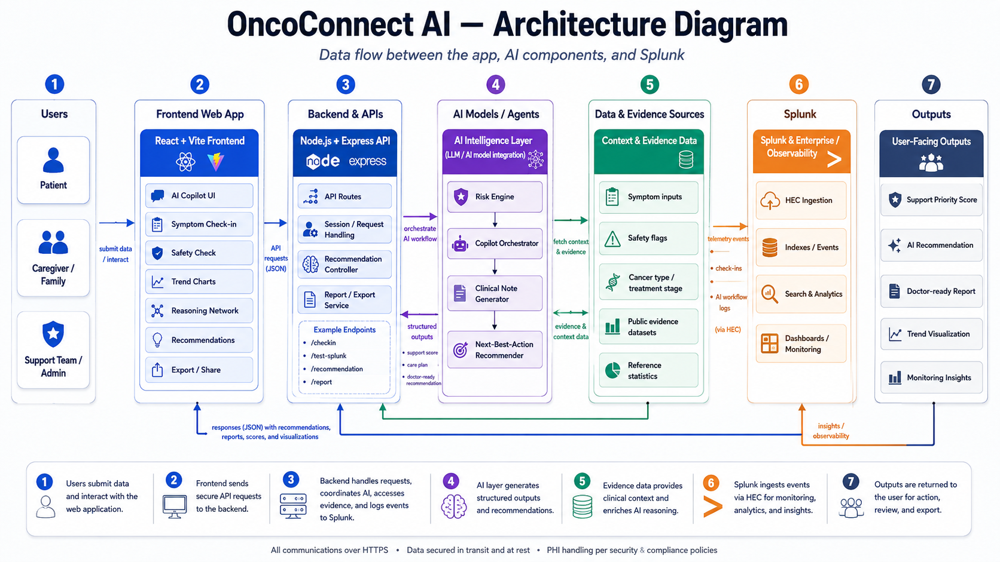

# OncoConnect AI

**Splunk-powered care observability and AI-assisted support coordination platform**

OncoConnect AI converts patient-reported symptom check-ins into structured Splunk telemetry, live cohort insights, explainable risk signals, and AI-assisted care coordination recommendations.

The project was developed for the Splunk AI Hackathon under the **Observability** track.

> **Important:** OncoConnect AI is a non-diagnostic prototype. It does not replace healthcare professionals, clinical assessment, emergency services, or medical advice.

---

## Overview

Cancer patients and caregivers often report symptoms through fragmented channels such as phone calls, handwritten notes, messaging applications, and isolated forms.

This makes it difficult for support teams to:

* Observe symptom changes over time
* Identify warning signs consistently
* Compare a current case with recent cases
* Prepare structured information for clinical conversations
* Monitor whether AI and support workflows operate correctly

OncoConnect AI applies observability principles to this human-centered workflow.

Patient inputs are validated, scored, sent to Splunk as structured telemetry, analyzed with an AI model, and presented through an explainable care intelligence dashboard.

---

## Key Features

* Patient, caregiver, and support-team user modes
* Structured symptom input for fatigue, pain, nausea, and mood
* Cancer type, treatment stage, city, age group, and concern context
* Backend validation enforcing symptom values between 0 and 10
* Rule-based symptom-risk calculation
* Deterministic red-flag safety override
* AI-generated non-diagnostic recommendations
* Rule-based fallback when the AI provider is unavailable
* Splunk HTTP Event Collector integration
* Splunk Search API integration
* Live indexed-event and average-risk metrics
* Live comparison with recent Splunk cohort data
* Interactive symptom trend visualization
* Explainable score calculation
* AI reasoning visualization
* Doctor-ready next actions
* PDF report export
* English and Turkish interface support

---

## Splunk Integration

OncoConnect AI uses Splunk in two directions.

### Event ingestion with Splunk HEC

The backend sends structured events to Splunk through the HTTP Event Collector.

Indexed events include:

* Patient symptom check-ins
* AI-generated summaries
* Calculated risk scores
* Risk levels
* Red-flag detections
* Safety override status
* AI model metadata
* Live cohort context

### Live data retrieval with the Splunk Search API

The dashboard retrieves live operational metrics from Splunk, including:

* Total indexed events
* Average risk
* Maximum risk
* Low-, medium-, and high-risk event counts
* Recent cohort context
* Current-case comparison with the previous 24 hours of indexed events

The current case is categorized as:

* Lower than the live cohort
* Similar to the live cohort
* Higher than the live cohort

---

## AI and Safety Architecture

The AI model receives:

* Patient and caregiver context
* Symptom values
* Computed risk level
* Public evidence context
* Live Splunk cohort context

The AI generates structured, non-diagnostic support guidance.

A deterministic safety layer operates independently from the language model.

When a warning sign is detected, such as:

* Fever
* Breathing difficulty
* Severe vomiting
* Confusion

the safety layer takes precedence over the AI-generated recommendation.

The final response is marked as:

```text
Rule-based safety override applied
```

This prevents a generative model from softening or overriding a critical safety signal.

---

## Technology Stack

### Frontend

* React
* Vite
* JavaScript
* CSS
* jsPDF

### Backend

* Node.js
* Express
* Axios
* dotenv
* CORS

### AI

* OpenRouter API
* Configurable OpenRouter-compatible model
* Rule-based fallback engine

### Observability

* Splunk Enterprise
* Splunk HTTP Event Collector
* Splunk Search REST API
* SPL queries for live risk aggregation

---

## Architecture



A detailed Mermaid version is available in [`ARCHITECTURE.md`](ARCHITECTURE.md).

---

## Project Structure

```text
oncoconnect-ai/
├── backend/
│   ├── server.js
│   ├── package.json
│   ├── .env.example
│   └── data/
├── frontend/
│   ├── package.json
│   ├── public/
│   └── src/
├── sample-data/
├── ARCHITECTURE.md
├── ARCHITECTURE.png
├── LICENSE
├── README.md
└── .gitignore
```

---

## Prerequisites

* Node.js 18 or later
* npm
* Splunk Enterprise or a compatible Splunk environment
* Splunk HTTP Event Collector token
* Splunk Search API credentials
* OpenRouter API key

---

## Installation

Clone the repository:

```bash
git clone https://github.com/mehmetcamofficial/oncoconnect-ai.git
cd oncoconnect-ai
```

Install backend dependencies:

```bash
cd backend
npm install
```

Install frontend dependencies:

```bash
cd ../frontend
npm install
```

---

## Environment Configuration

Create a local backend environment file:

```bash
cd backend
cp .env.example .env
```

Configure the required values in `backend/.env`.

```env
PORT=5050

SPLUNK_HEC_URL=https://localhost:8088/services/collector/event
SPLUNK_HEC_TOKEN=your_splunk_hec_token
SPLUNK_INDEX=main

SPLUNK_SEARCH_URL=https://localhost:8089
SPLUNK_USERNAME=your_splunk_username
SPLUNK_PASSWORD=your_splunk_password

OPENROUTER_API_KEY=your_openrouter_api_key
OPENROUTER_MODEL=openai/gpt-4o-mini
OPENROUTER_SITE_URL=http://localhost:5173
OPENROUTER_SITE_NAME=OncoConnect AI
```

Never commit the real `.env` file.

---

## Running the Backend

```bash
cd backend
node server.js
```

The backend runs at:

```text
http://localhost:5050
```

Test it:

```bash
curl http://localhost:5050/
```

---

## Running the Frontend

Open a second terminal:

```bash
cd frontend
npm run dev -- --host 0.0.0.0 --port 5173
```

Open:

```text
http://localhost:5173
```

---

## Core API Endpoints

| Method | Endpoint          | Purpose                                 |
| ------ | ----------------- | --------------------------------------- |
| GET    | `/`               | Backend health check                    |
| POST   | `/test-splunk`    | Test Splunk HEC connectivity            |
| POST   | `/checkin`        | Validate and index a symptom check-in   |
| POST   | `/ai-summary`     | Generate an AI-assisted support summary |
| GET    | `/splunk/metrics` | Retrieve live Splunk metrics            |

---

## Example Check-In

```json
{
  "patientId": "DEMO-001",
  "cancerType": "Breast cancer",
  "treatmentStage": "Receiving chemotherapy",
  "city": "Istanbul",
  "ageGroup": "45-54",
  "mainConcern": "Fatigue / weakness",
  "fatigue": 6,
  "pain": 4,
  "nausea": 3,
  "mood": 5,
  "feverFlag": false,
  "breathingDifficultyFlag": false,
  "severeVomitingFlag": false,
  "confusionFlag": false
}
```

---

## Input Validation

The backend validates all symptom inputs.

Accepted range:

```text
0–10
```

Invalid values receive:

```text
HTTP 400 Bad Request
```

Example:

```json
{
  "success": false,
  "error": "INVALID_INPUT",
  "field": "fatigue",
  "message": "fatigue must be between 0 and 10."
}
```

---

## Live Cohort Comparison

The current case uses the following symptom-risk formula:

```text
fatigue + nausea + pain + (10 - mood)
```

The result is compared with the live average risk returned by Splunk.

Comparison thresholds:

```text
Difference below -3: Lower
Difference from -3 to +3: Similar
Difference above +3: Higher
```

The live cohort context is also supplied to the AI recommendation request.

---

## Demo Flow

1. Open the Care Intelligence Cockpit.
2. Select the user role and support goal.
3. Enter cancer and treatment context.
4. Adjust symptom values.
5. Click **Run AI Analysis**.
6. Observe the score, trend, telemetry, and reasoning network.
7. Review the live Splunk cohort comparison.
8. Click **Get Recommendation**.
9. Select a warning sign such as fever.
10. Run the recommendation again and observe the deterministic safety override.
11. Export the doctor-ready PDF report.

---

## Privacy and Security Considerations

The current hackathon prototype includes:

* Environment-based secret management
* Backend input validation
* Rule-based red-flag detection
* Non-diagnostic AI instructions
* AI-provider fallback handling
* Explicit safety notices
* Structured Splunk telemetry

A production deployment would additionally require:

* Authentication and authorization
* Encryption at rest
* Production HTTPS
* Audit logging
* Data minimization
* Retention controls
* Consent management
* KVKK and GDPR compliance assessment
* Clinical validation and governance

---

## Limitations

* This is a hackathon prototype, not a certified medical device.
* It has not undergone clinical validation.
* It does not diagnose disease or select treatment.
* It does not replace a healthcare professional.
* Splunk and AI services must be configured locally.
* Live cohort comparisons depend on the available indexed events.

---

## License

This project is licensed under the MIT License.

See [`LICENSE`](LICENSE).

---

## Author

**Mehmet Cam**

GitHub: `mehmetcamofficial`

